# What are European Values?

Human dignity, freedom, equality, democracy. "European values" often sound noble, but vague. Using data from the European Values Study, we analyzed what Europeans agree on – and what divides them.

**Story**: You can read the full story here: [English](https://www.dw.com/g-48531432) | [German](https://www.dw.com/g-48531726). You can also view it on Facebook and Instagram.

**Research, data analysis and visualization, writing:** [Kira Schacht](https://twitter.com/daten_drang)

Data for this analysis comes from the first pre-release of the European Values study 2017. It includes data for 16 countries, 14 of which were used for this story: *Austria, Belarus, Bulgaria, Croatia, the Czech Republic, Germany, Iceland, Poland, Russia, Slovakia, Slovenia, Spain, Switzerland and the Netherlands*. 
The data is publicly accessible via the GESIS data catalogue [ZACAT](https://zacat.gesis.org/webview/). The following tables provide direct links to the respective data.

## Image gallery Website

| Image  | Topic | Source |
| ------------- | ------------- | ------------- |
| 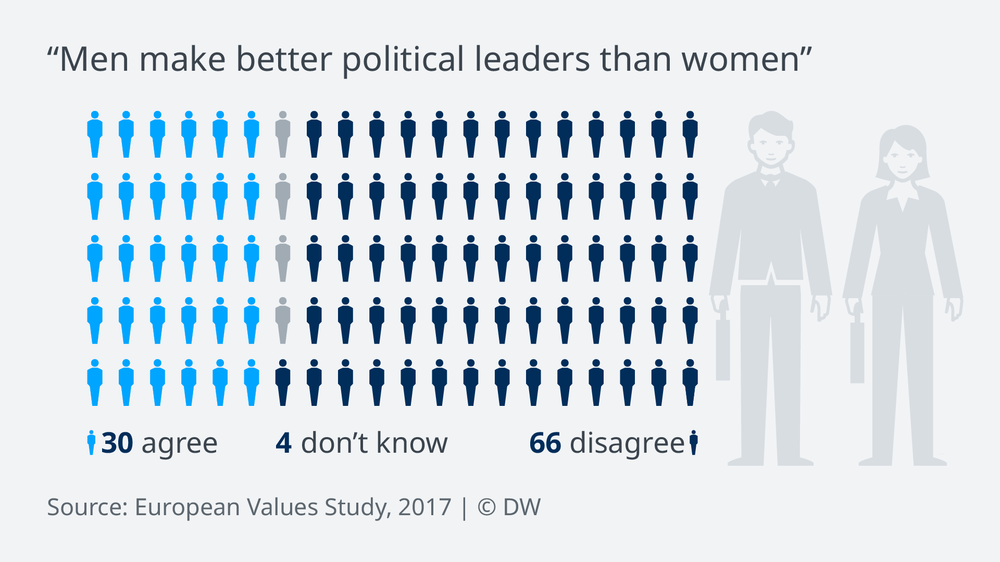  | Gender equality: 30 out of 100 Europeans think that, on the whole, men make better political leaders than women  | [Link](http://zacat.gesis.org/webview/index.jsp?stubs=V102&layers=V11&charttype=null&study=http%3A%2F%2F193.175.238.79%3A80%2Fobj%2FfStudy%2FZA7500&V11subset=40+-+756%2C81055&mode=table&v=2&gs=2&group=agg%7CV102%7C1%7C1%2C2%7Cyes%7Ctrue%7C51223&group=agg%7CV102%7C1%7C3%2C4%7Cno%7Ctrue%7C10803&group=agg%7CV11%7C1%7C40%2C100%2C112%2C191%2C203%2C276%2C352%2C528%2C616%2C643%2C703%2C705%2C724%2C756%7CEurope_custom%7Ctrue%7C81055&V102subset=-1%2C51223%2C10803&V102slice=-1&V11slice=81055&top=yes)  |
| 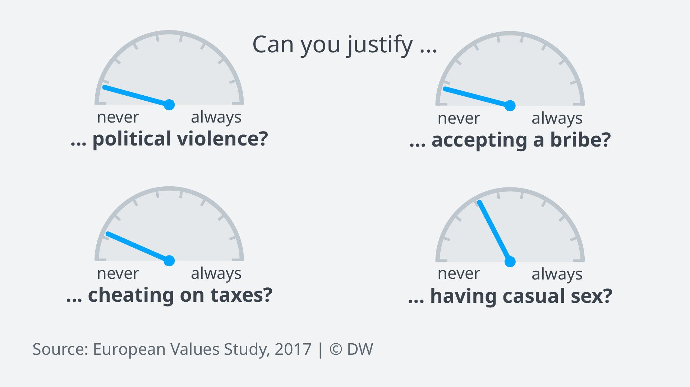  | What Europeans agree on: Political violence, bribery and tax fraud are off-limits  | [Political violence](http://zacat.gesis.org/webview/index.jsp?v=2&stubs=http%3A%2F%2F193.175.238.79%3A80%2Fobj%2FfVariable%2FZA7500_V195&layers=http%3A%2F%2F193.175.238.79%3A80%2Fobj%2FfVariable%2FZA7500_V11&V195slice=1&study=http%3A%2F%2F193.175.238.79%3A80%2Fobj%2FfStudy%2FZA7500&charttype=null&gs=1&group=agg%7CV11%7C1%7C40%2C100%2C112%2C191%2C203%2C276%2C352%2C528%2C616%2C643%2C703%2C705%2C724%2C756%7CEurope_custom%7Ctrue%7C63144&V11slice=63144&mode=table&top=yes) [Accepting a bribe](http://zacat.gesis.org/webview/index.jsp?v=2&stubs=http%3A%2F%2F193.175.238.79%3A80%2Fobj%2FfVariable%2FZA7500_V185&V185slice=1&layers=http%3A%2F%2F193.175.238.79%3A80%2Fobj%2FfVariable%2FZA7500_V11&study=http%3A%2F%2F193.175.238.79%3A80%2Fobj%2FfStudy%2FZA7500&charttype=null&gs=1&group=agg%7CV11%7C1%7C40%2C100%2C112%2C191%2C203%2C276%2C352%2C528%2C616%2C643%2C703%2C705%2C724%2C756%7CEurope_custom%7Ctrue%7C63144&V11slice=63144&mode=table&top=yes) [Cheating on taxes](http://zacat.gesis.org/webview/index.jsp?v=2&stubs=http%3A%2F%2F193.175.238.79%3A80%2Fobj%2FfVariable%2FZA7500_V183&V183slice=1&layers=http%3A%2F%2F193.175.238.79%3A80%2Fobj%2FfVariable%2FZA7500_V11&study=http%3A%2F%2F193.175.238.79%3A80%2Fobj%2FfStudy%2FZA7500&charttype=null&gs=1&group=agg%7CV11%7C1%7C40%2C100%2C112%2C191%2C203%2C276%2C352%2C528%2C616%2C643%2C703%2C705%2C724%2C756%7CEurope_custom%7Ctrue%7C63144&V11slice=63144&mode=table&top=yes) [Having casual sex](http://zacat.gesis.org/webview/index.jsp?v=2&stubs=http%3A%2F%2F193.175.238.79%3A80%2Fobj%2FfVariable%2FZA7500_V191&V191slice=1&layers=http%3A%2F%2F193.175.238.79%3A80%2Fobj%2FfVariable%2FZA7500_V11&study=http%3A%2F%2F193.175.238.79%3A80%2Fobj%2FfStudy%2FZA7500&charttype=null&gs=1&group=agg%7CV11%7C1%7C40%2C100%2C112%2C191%2C203%2C276%2C352%2C528%2C616%2C643%2C703%2C705%2C724%2C756%7CEurope_custom%7Ctrue%7C63144&V11slice=63144&mode=table&top=yes) |
| 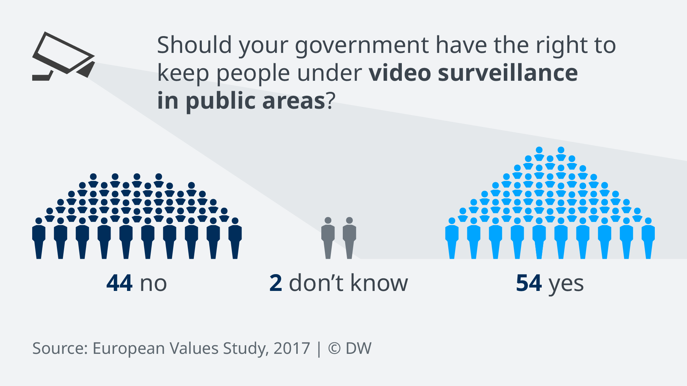  | Europeans everywhere disagree on video surveillance  | [Link](http://zacat.gesis.org/webview/index.jsp?V85subset=1+-+2%2C-1&V240subset=-1%2C96470%2C63904&stubs=V240&layers=V11&charttype=null&study=http%3A%2F%2F193.175.238.79%3A80%2Fobj%2FfStudy%2FZA7500&mode=table&V11subset=81055&v=2&V82subset=1+-+3%2C-2%2C-1&V86subset=1+-+2%2C-1&gs=2&tabcontenttype=row&V240slice=-1&group=agg%7CV240%7C1%7C1%2C2%7Cyes%7Ctrue%7C96470&group=agg%7CV240%7C1%7C3%2C4%7Cno%7Ctrue%7C63904&group=agg%7CV11%7C1%7C40%2C100%2C112%2C191%2C203%2C276%2C352%2C528%2C616%2C643%2C703%2C705%2C724%2C756%7CEurope_custom%7Ctrue%7C81055&V11slice=81055&top=yes)  |
| 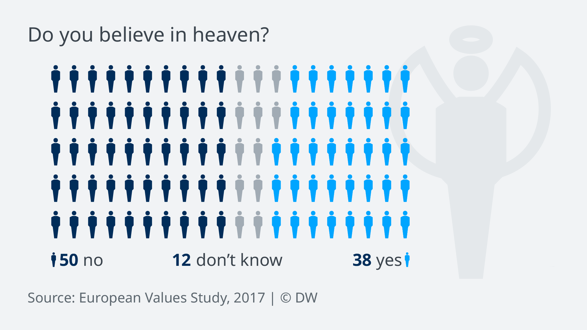  | Europeans are split on matters of religion  | [Link](http://zacat.gesis.org/webview/index.jsp?headers=http%3A%2F%2F193.175.238.79%3A80%2Fobj%2FfVariable%2FZA7500_V86&V85subset=1+-+2%2C-1&stubs=http%3A%2F%2F193.175.238.79%3A80%2Fobj%2FfVariable%2FZA7500_V85&layers=http%3A%2F%2F193.175.238.79%3A80%2Fobj%2FfVariable%2FZA7500_V11&charttype=null&study=http%3A%2F%2F193.175.238.79%3A80%2Fobj%2FfStudy%2FZA7500&V11subset=81055&mode=table&v=2&V85slice=1&V86slice=1&V86subset=1+-+2%2C-1&tabcontenttype=rowcol&gs=2&group=agg%7CV11%7C1%7C40%2C100%2C112%2C191%2C203%2C276%2C352%2C528%2C616%2C643%2C703%2C705%2C724%2C756%7CEurope_custom%7Ctrue%7C81055&V11slice=81055&top=yes)  |
| 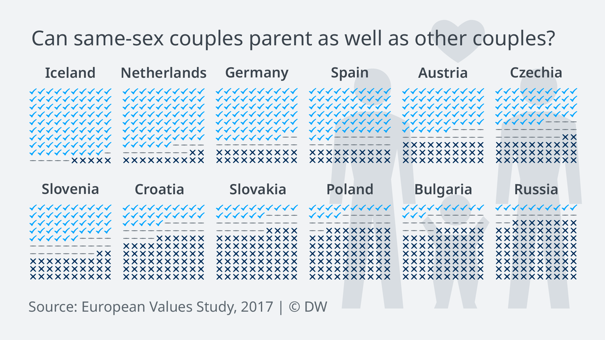  | For same-sex partners with children, Iceland is more accepting  | [Link](http://zacat.gesis.org/webview/index.jsp?headers=http%3A%2F%2F193.175.238.79%3A80%2Fobj%2FfVariable%2FZA7500_V108&V85subset=1+-+2%2C-1&stubs=http%3A%2F%2F193.175.238.79%3A80%2Fobj%2FfVariable%2FZA7500_V11&study=http%3A%2F%2F193.175.238.79%3A80%2Fobj%2FfStudy%2FZA7500&charttype=null&V11subset=40%2C100+-+203%2C276+-+756%2C81055&mode=table&v=2&V108slice=3&V86subset=1+-+2%2C-1&gs=2&tabcontenttype=row&group=agg%7CV11%7C1%7C40%2C100%2C112%2C191%2C203%2C276%2C352%2C528%2C616%2C643%2C703%2C705%2C724%2C756%7CEurope_custom%7Ctrue%7C81055&group=agg%7CV108%7C1%7C1%2C2%7Cyes%7Ctrue%7C142731&group=agg%7CV108%7C1%7C4%2C5%7Cno%7Ctrue%7C126715&V11slice=81055&V108subset=3%2C142731%2C126715&top=yes)  |
| 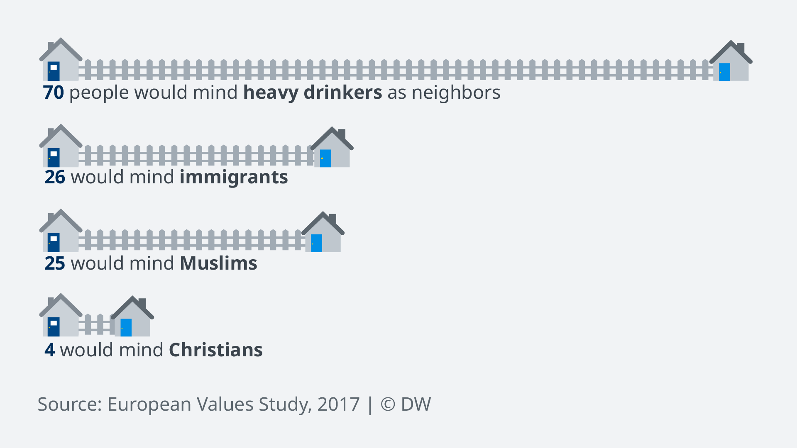  | 25 of 100 respondents would mind having Muslims as neighbors  | [Heavy drinkers](http://zacat.gesis.org/webview/index.jsp?stubs=V40&layers=V11&study=http%3A%2F%2F193.175.238.79%3A80%2Fobj%2FfStudy%2FZA7500&charttype=null&mode=table&V11subset=40+-+756%2C35110&v=2&V40slice=1&gs=3&group=agg%7CV11%7C1%7C40%2C100%2C112%2C191%2C203%2C276%2C352%2C528%2C616%2C643%2C703%2C705%2C724%2C756%7CEurope_custom%7Ctrue%7C35110&V11slice=35110&V40subset=1+-+2%2C-2%2C-1&top=yes) [Immigrants](http://zacat.gesis.org/webview/index.jsp?stubs=V41&V41subset=1+-+2%2C-2%2C-1&layers=V11&study=http%3A%2F%2F193.175.238.79%3A80%2Fobj%2FfStudy%2FZA7500&charttype=null&mode=table&V11subset=40+-+756%2C35110&v=2&V41slice=1&gs=3&group=agg%7CV11%7C1%7C40%2C100%2C112%2C191%2C203%2C276%2C352%2C528%2C616%2C643%2C703%2C705%2C724%2C756%7CEurope_custom%7Ctrue%7C35110&V11slice=35110&top=yes) [Muslims](http://zacat.gesis.org/webview/index.jsp?V45subset=1+-+2%2C-2%2C-1&stubs=V45&layers=V11&study=http%3A%2F%2F193.175.238.79%3A80%2Fobj%2FfStudy%2FZA7500&charttype=null&mode=table&V11subset=40+-+756%2C35110&v=2&V45slice=1&gs=3&group=agg%7CV11%7C1%7C40%2C100%2C112%2C191%2C203%2C276%2C352%2C528%2C616%2C643%2C703%2C705%2C724%2C756%7CEurope_custom%7Ctrue%7C35110&V11slice=35110&top=yes) [Christians](http://zacat.gesis.org/webview/index.jsp?stubs=V44&layers=V11&study=http%3A%2F%2F193.175.238.79%3A80%2Fobj%2FfStudy%2FZA7500&charttype=null&mode=table&V11subset=40+-+756%2C35110&v=2&V44slice=1&gs=3&group=agg%7CV11%7C1%7C40%2C100%2C112%2C191%2C203%2C276%2C352%2C528%2C616%2C643%2C703%2C705%2C724%2C756%7CEurope_custom%7Ctrue%7C35110&V11slice=35110&V44subset=1+-+2%2C-2%2C-1&top=yes)  |
| 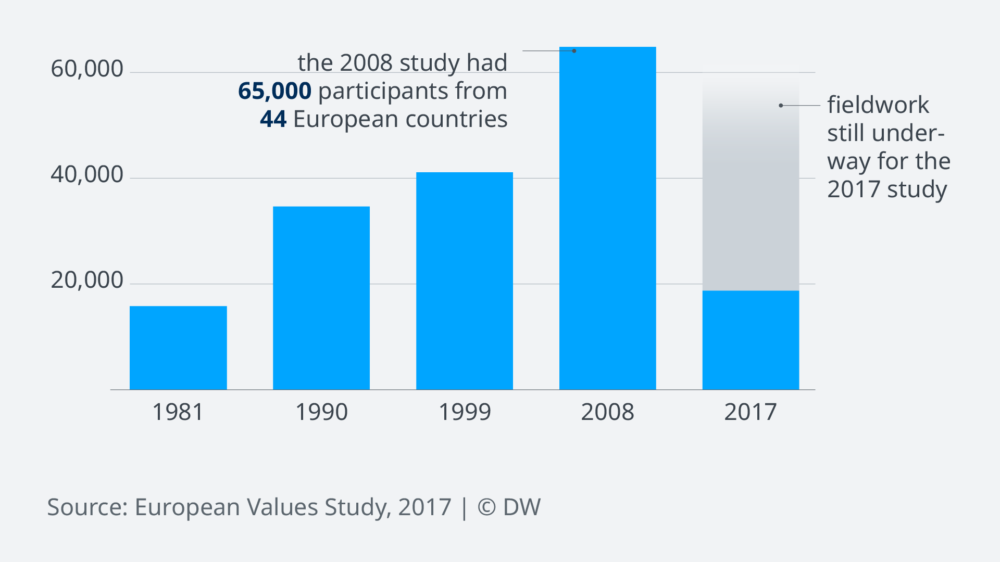  | Studying European values  | See Excel file `participants.xlsx`  |

## Social media images

| Image  | Topic | Source |
| ------------- | ------------- | ------------- |
| 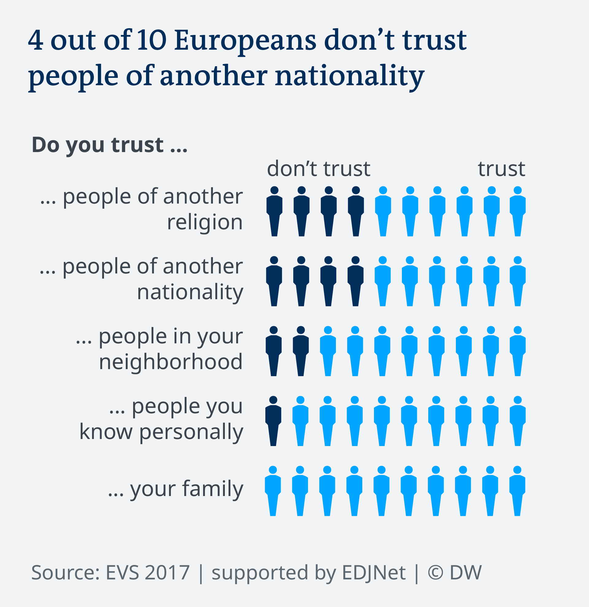  | 4 out of 10 Europeans don’t trust people of another nationality.  | [Another religion](http://zacat.gesis.org/webview/index.jsp?v=2&stubs=V57&V57slice=1&layers=http%3A%2F%2F193.175.238.79%3A80%2Fobj%2FfVariable%2FZA7500_V11&V57subset=1+-+4%2C-2%2C-1&study=http%3A%2F%2F193.175.238.79%3A80%2Fobj%2FfStudy%2FZA7500&gs=2&group=agg%7CV11%7C1%7C40%2C100%2C112%2C191%2C203%2C276%2C352%2C528%2C616%2C643%2C703%2C705%2C724%2C756%7CEurope_custom%7Ctrue%7C35110&V11slice=35110&mode=table&top=yes) [Another nationality](http://zacat.gesis.org/webview/index.jsp?stubs=http%3A%2F%2F193.175.238.79%3A80%2Fobj%2FfVariable%2FZA7500_V58&layers=http%3A%2F%2F193.175.238.79%3A80%2Fobj%2FfVariable%2FZA7500_V11&study=http%3A%2F%2F193.175.238.79%3A80%2Fobj%2FfStudy%2FZA7500&charttype=null&V157slice=1&mode=table&v=2&V58slice=1&V82slice=1&gs=2&group=agg%7CV11%7C1%7C40%2C100%2C112%2C191%2C203%2C276%2C352%2C528%2C616%2C643%2C703%2C705%2C724%2C756%7CEurope_custom%7Ctrue%7C81055&V11slice=81055&top=yes) [Neighbourhood](http://zacat.gesis.org/webview/index.jsp?stubs=http%3A%2F%2F193.175.238.79%3A80%2Fobj%2FfVariable%2FZA7500_V54&layers=http%3A%2F%2F193.175.238.79%3A80%2Fobj%2FfVariable%2FZA7500_V11&study=http%3A%2F%2F193.175.238.79%3A80%2Fobj%2FfStudy%2FZA7500&charttype=null&V157slice=1&mode=table&v=2&V82slice=1&V54slice=1&gs=2&group=agg%7CV11%7C1%7C40%2C100%2C112%2C191%2C203%2C276%2C352%2C528%2C616%2C643%2C703%2C705%2C724%2C756%7CEurope_custom%7Ctrue%7C81055&V11slice=81055&top=yes) [Know personally](http://zacat.gesis.org/webview/index.jsp?stubs=http%3A%2F%2F193.175.238.79%3A80%2Fobj%2FfVariable%2FZA7500_V55&layers=http%3A%2F%2F193.175.238.79%3A80%2Fobj%2FfVariable%2FZA7500_V11&study=http%3A%2F%2F193.175.238.79%3A80%2Fobj%2FfStudy%2FZA7500&charttype=null&V157slice=1&mode=table&v=2&V82slice=1&V55slice=1&gs=2&group=agg%7CV11%7C1%7C40%2C100%2C112%2C191%2C203%2C276%2C352%2C528%2C616%2C643%2C703%2C705%2C724%2C756%7CEurope_custom%7Ctrue%7C81055&V11slice=81055&top=yes) [Family](http://zacat.gesis.org/webview/index.jsp?stubs=http%3A%2F%2F193.175.238.79%3A80%2Fobj%2FfVariable%2FZA7500_V53&layers=http%3A%2F%2F193.175.238.79%3A80%2Fobj%2FfVariable%2FZA7500_V11&study=http%3A%2F%2F193.175.238.79%3A80%2Fobj%2FfStudy%2FZA7500&charttype=null&V53slice=1&V157slice=1&mode=table&v=2&V82slice=1&gs=2&group=agg%7CV11%7C1%7C40%2C100%2C112%2C191%2C203%2C276%2C352%2C528%2C616%2C643%2C703%2C705%2C724%2C756%7CEurope_custom%7Ctrue%7C81055&V11slice=81055&top=yes)  |
| 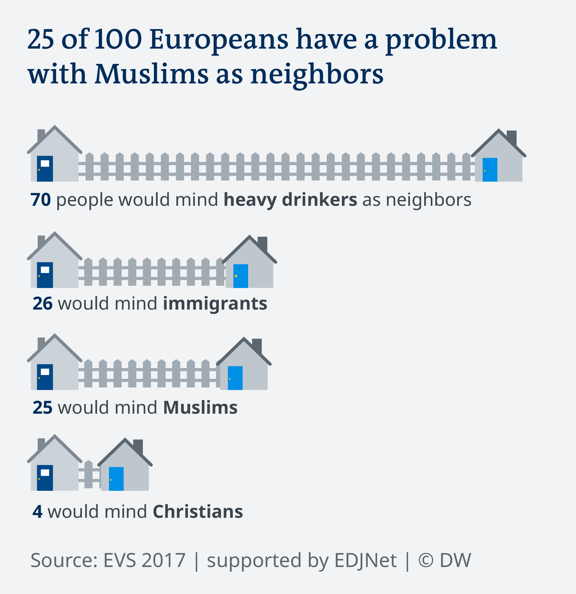  | 25 of 100 Europeans have a problem with Muslims as neighbors  | [Heavy drinkers](http://zacat.gesis.org/webview/index.jsp?stubs=V40&layers=V11&study=http%3A%2F%2F193.175.238.79%3A80%2Fobj%2FfStudy%2FZA7500&charttype=null&mode=table&V11subset=40+-+756%2C35110&v=2&V40slice=1&gs=3&group=agg%7CV11%7C1%7C40%2C100%2C112%2C191%2C203%2C276%2C352%2C528%2C616%2C643%2C703%2C705%2C724%2C756%7CEurope_custom%7Ctrue%7C35110&V11slice=35110&V40subset=1+-+2%2C-2%2C-1&top=yes) [Immigrants](http://zacat.gesis.org/webview/index.jsp?stubs=V41&V41subset=1+-+2%2C-2%2C-1&layers=V11&study=http%3A%2F%2F193.175.238.79%3A80%2Fobj%2FfStudy%2FZA7500&charttype=null&mode=table&V11subset=40+-+756%2C35110&v=2&V41slice=1&gs=3&group=agg%7CV11%7C1%7C40%2C100%2C112%2C191%2C203%2C276%2C352%2C528%2C616%2C643%2C703%2C705%2C724%2C756%7CEurope_custom%7Ctrue%7C35110&V11slice=35110&top=yes) [Muslims](http://zacat.gesis.org/webview/index.jsp?V45subset=1+-+2%2C-2%2C-1&stubs=V45&layers=V11&study=http%3A%2F%2F193.175.238.79%3A80%2Fobj%2FfStudy%2FZA7500&charttype=null&mode=table&V11subset=40+-+756%2C35110&v=2&V45slice=1&gs=3&group=agg%7CV11%7C1%7C40%2C100%2C112%2C191%2C203%2C276%2C352%2C528%2C616%2C643%2C703%2C705%2C724%2C756%7CEurope_custom%7Ctrue%7C35110&V11slice=35110&top=yes) [Christians](http://zacat.gesis.org/webview/index.jsp?stubs=V44&layers=V11&study=http%3A%2F%2F193.175.238.79%3A80%2Fobj%2FfStudy%2FZA7500&charttype=null&mode=table&V11subset=40+-+756%2C35110&v=2&V44slice=1&gs=3&group=agg%7CV11%7C1%7C40%2C100%2C112%2C191%2C203%2C276%2C352%2C528%2C616%2C643%2C703%2C705%2C724%2C756%7CEurope_custom%7Ctrue%7C35110&V11slice=35110&V44subset=1+-+2%2C-2%2C-1&top=yes)  |
| 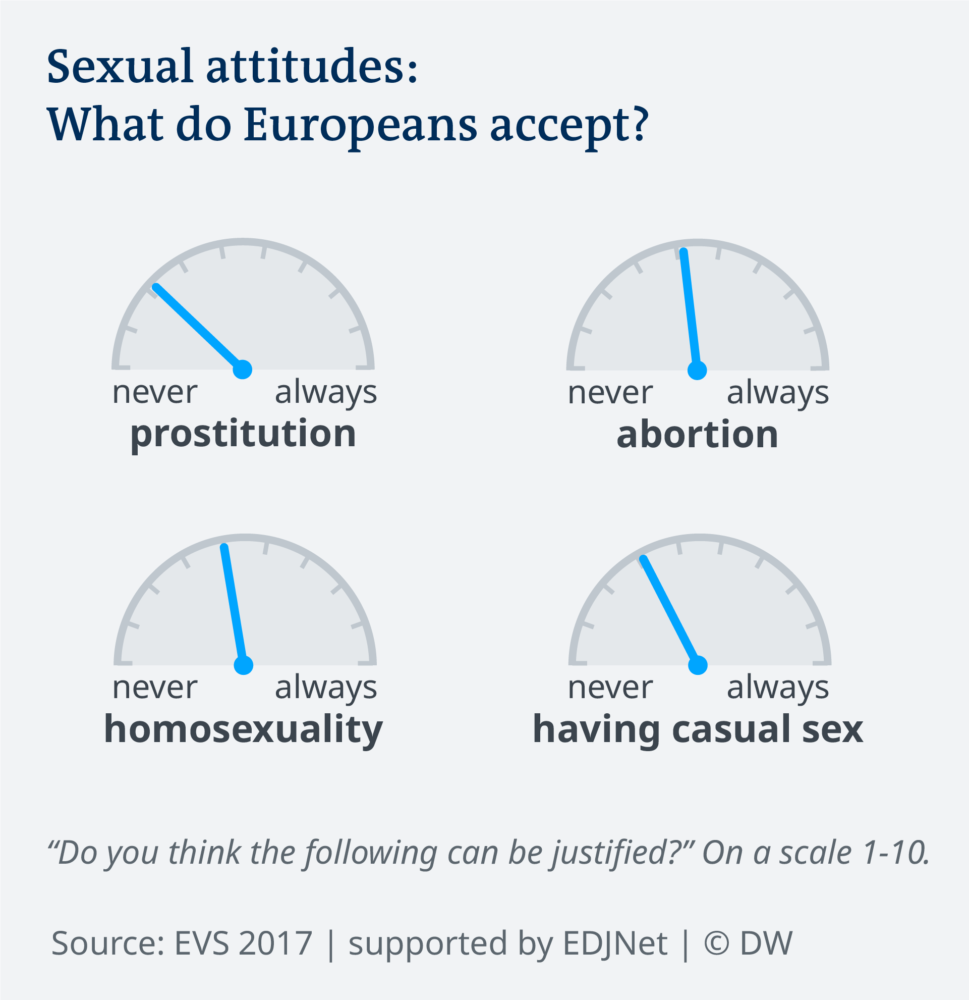  | Sexual attitudes: What do Europeans accept?  | [Prostitution](http://zacat.gesis.org/webview/index.jsp?v=2&stubs=http%3A%2F%2F193.175.238.79%3A80%2Fobj%2FfVariable%2FZA7500_V193&layers=http%3A%2F%2F193.175.238.79%3A80%2Fobj%2FfVariable%2FZA7500_V11&V193slice=1&study=http%3A%2F%2F193.175.238.79%3A80%2Fobj%2FfStudy%2FZA7500&gs=1&group=agg%7CV11%7C1%7C40%2C100%2C112%2C191%2C203%2C276%2C352%2C528%2C616%2C643%2C703%2C705%2C724%2C756%7CEurope_custom%7Ctrue%7C63144&V11slice=63144&mode=table&top=yes) [Abortion](http://zacat.gesis.org/webview/index.jsp?v=2&V187slice=1&stubs=http%3A%2F%2F193.175.238.79%3A80%2Fobj%2FfVariable%2FZA7500_V187&layers=http%3A%2F%2F193.175.238.79%3A80%2Fobj%2FfVariable%2FZA7500_V11&study=http%3A%2F%2F193.175.238.79%3A80%2Fobj%2FfStudy%2FZA7500&charttype=null&gs=1&group=agg%7CV11%7C1%7C40%2C100%2C112%2C191%2C203%2C276%2C352%2C528%2C616%2C643%2C703%2C705%2C724%2C756%7CEurope_custom%7Ctrue%7C63144&V11slice=63144&mode=table&top=yes) [Homosexuality](http://zacat.gesis.org/webview/index.jsp?v=2&stubs=http%3A%2F%2F193.175.238.79%3A80%2Fobj%2FfVariable%2FZA7500_V186&layers=http%3A%2F%2F193.175.238.79%3A80%2Fobj%2FfVariable%2FZA7500_V11&V186slice=1&study=http%3A%2F%2F193.175.238.79%3A80%2Fobj%2FfStudy%2FZA7500&charttype=null&gs=1&group=agg%7CV11%7C1%7C40%2C100%2C112%2C191%2C203%2C276%2C352%2C528%2C616%2C643%2C703%2C705%2C724%2C756%7CEurope_custom%7Ctrue%7C63144&V11slice=63144&mode=table&top=yes) [Having casual sex](http://zacat.gesis.org/webview/index.jsp?v=2&stubs=http%3A%2F%2F193.175.238.79%3A80%2Fobj%2FfVariable%2FZA7500_V191&V191slice=1&layers=http%3A%2F%2F193.175.238.79%3A80%2Fobj%2FfVariable%2FZA7500_V11&study=http%3A%2F%2F193.175.238.79%3A80%2Fobj%2FfStudy%2FZA7500&charttype=null&gs=1&group=agg%7CV11%7C1%7C40%2C100%2C112%2C191%2C203%2C276%2C352%2C528%2C616%2C643%2C703%2C705%2C724%2C756%7CEurope_custom%7Ctrue%7C63144&V11slice=63144&mode=table&top=yes)  |
| 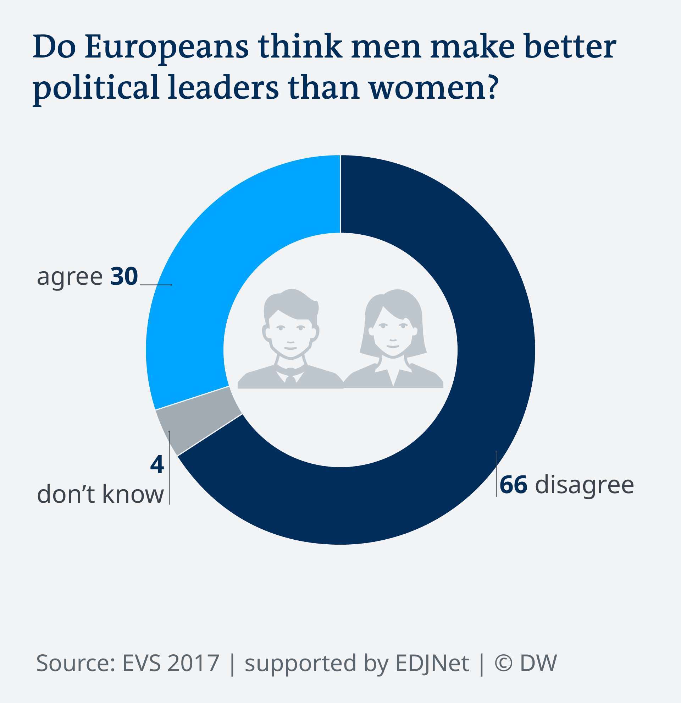  | Do Europeans think men make better political leaders than women?  | [Link](http://zacat.gesis.org/webview/index.jsp?stubs=V102&layers=V11&charttype=null&study=http%3A%2F%2F193.175.238.79%3A80%2Fobj%2FfStudy%2FZA7500&V11subset=40+-+756%2C81055&mode=table&v=2&gs=2&group=agg%7CV102%7C1%7C1%2C2%7Cyes%7Ctrue%7C51223&group=agg%7CV102%7C1%7C3%2C4%7Cno%7Ctrue%7C10803&group=agg%7CV11%7C1%7C40%2C100%2C112%2C191%2C203%2C276%2C352%2C528%2C616%2C643%2C703%2C705%2C724%2C756%7CEurope_custom%7Ctrue%7C81055&V102subset=-1%2C51223%2C10803&V102slice=-1&V11slice=81055&top=yes)  |
| 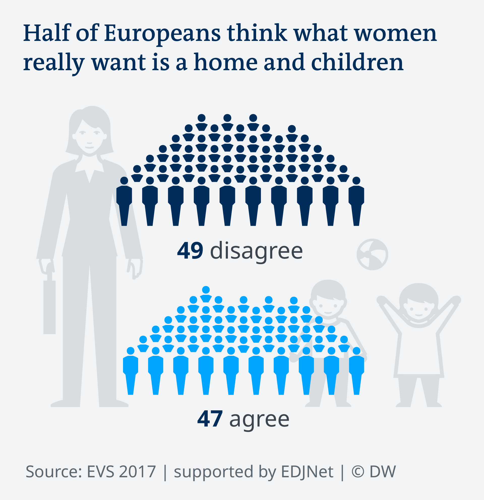  | Half of Europeans think what women really want is a home and children  | [Link](http://zacat.gesis.org/webview/index.jsp?stubs=V99&layers=V11&study=http%3A%2F%2F193.175.238.79%3A80%2Fobj%2FfStudy%2FZA7500&charttype=null&V99subset=1+-+4%2C-1&mode=table&V11subset=40+-+756%2C81055&V99slice=1&v=2&gs=2&group=agg%7CV11%7C1%7C40%2C100%2C112%2C191%2C203%2C276%2C352%2C528%2C616%2C643%2C703%2C705%2C724%2C756%7CEurope_custom%7Ctrue%7C81055&V11slice=81055&top=yes)  |
| 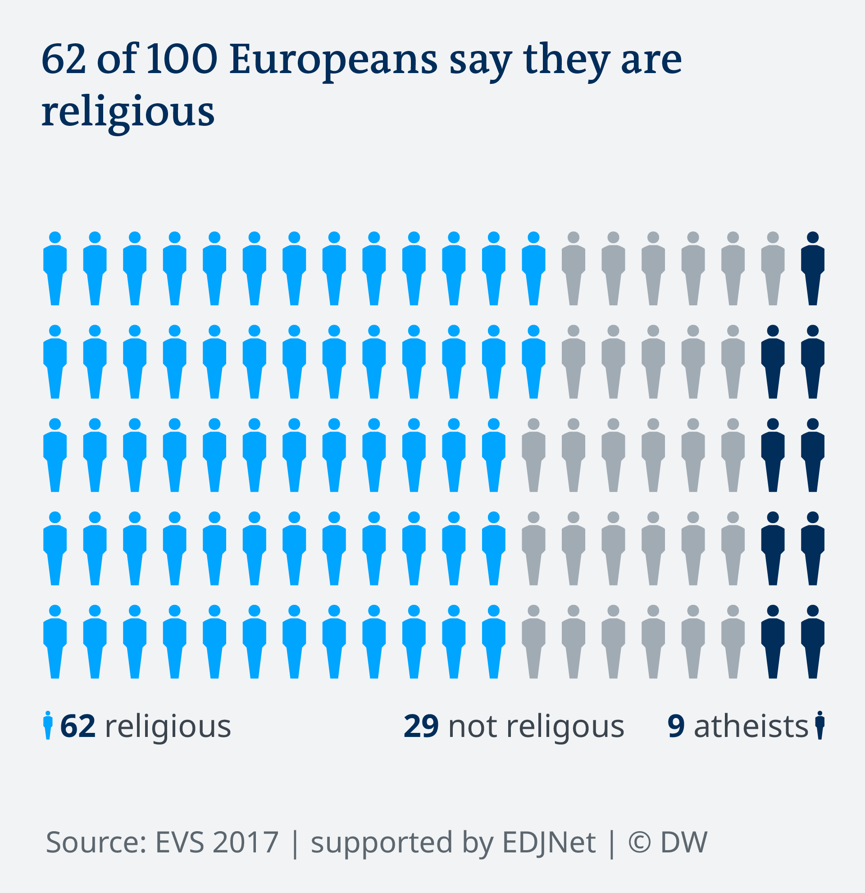  | 62 of 100 Europeans say they are religious  | [Link](http://zacat.gesis.org/webview/index.jsp?v=2&stubs=http%3A%2F%2F193.175.238.79%3A80%2Fobj%2FfVariable%2FZA7500_V82&layers=http%3A%2F%2F193.175.238.79%3A80%2Fobj%2FfVariable%2FZA7500_V11&V82slice=1&study=http%3A%2F%2F193.175.238.79%3A80%2Fobj%2FfStudy%2FZA7500&charttype=null&gs=2&group=agg%7CV11%7C1%7C40%2C100%2C112%2C191%2C203%2C276%2C352%2C528%2C616%2C643%2C703%2C705%2C724%2C756%7CEurope_custom%7Ctrue%7C81055&V11slice=81055&V157slice=1&mode=table&top=yes)  |
| 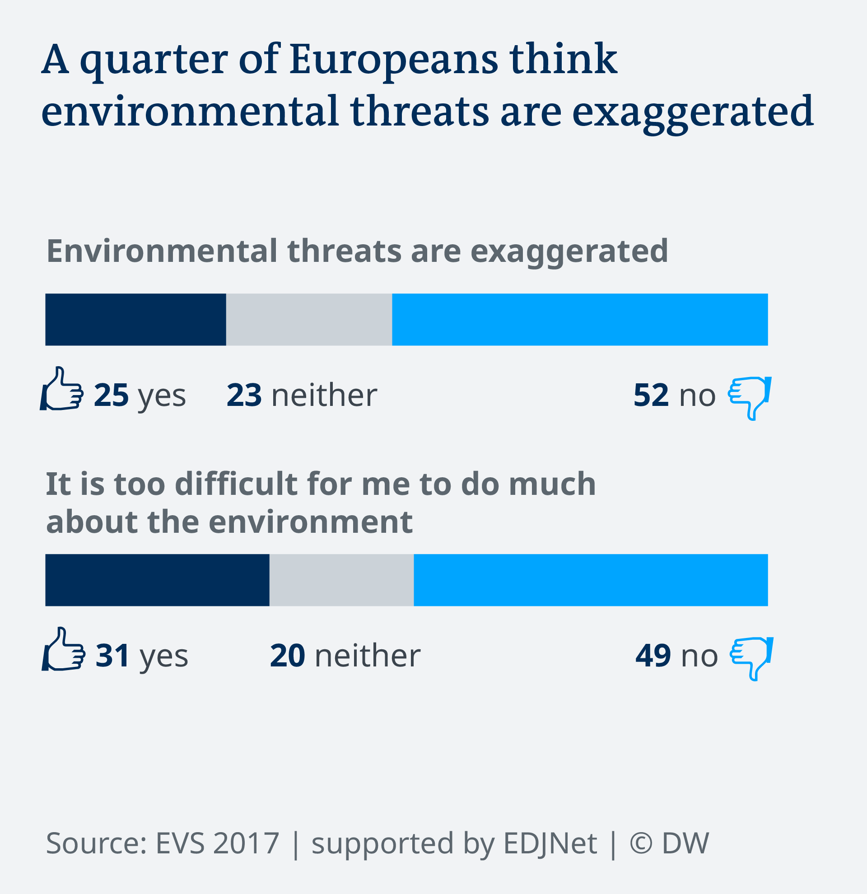  | A quarter of Europeans think envorinmental threats are exaggerated  | [Link](http://zacat.gesis.org/webview/index.jsp?V235slice=3&stubs=V235&layers=V11&study=http%3A%2F%2F193.175.238.79%3A80%2Fobj%2FfStudy%2FZA7500&charttype=null&V11subset=40+-+756%2C81055&mode=table&v=2&V235subset=3%2C110076%2C69666&gs=2&group=agg%7CV235%7C1%7C1%2C2%7Cyes%7Ctrue%7C110076&group=agg%7CV235%7C1%7C4%2C5%7Cno%7Ctrue%7C69666&group=agg%7CV11%7C1%7C40%2C100%2C112%2C191%2C203%2C276%2C352%2C528%2C616%2C643%2C703%2C705%2C724%2C756%7CEurope_custom%7Ctrue%7C81055&V11slice=81055&top=yes)  |
| 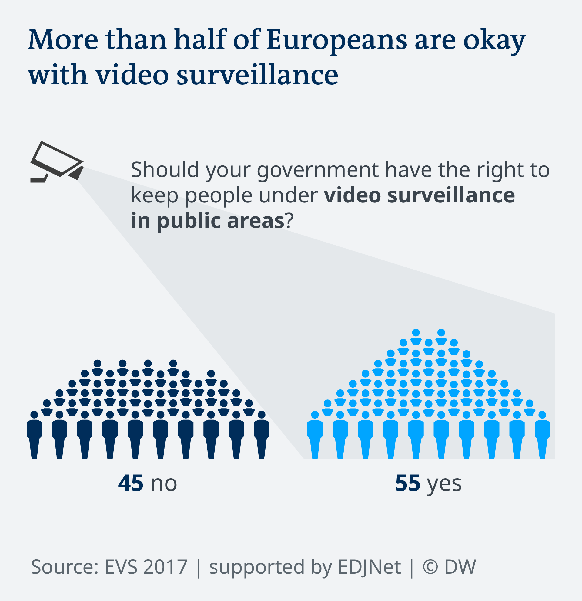  | More than half of Europeans are okay with video surveillance  | [Link](http://zacat.gesis.org/webview/index.jsp?V85subset=1+-+2%2C-1&stubs=http%3A%2F%2F193.175.238.79%3A80%2Fobj%2FfVariable%2FZA7500_V240&layers=http%3A%2F%2F193.175.238.79%3A80%2Fobj%2FfVariable%2FZA7500_V11&charttype=null&study=http%3A%2F%2F193.175.238.79%3A80%2Fobj%2FfStudy%2FZA7500&V11subset=81055&mode=table&v=2&V86slice=1&V82subset=1+-+3%2C-2%2C-1&V86subset=1+-+2%2C-1&V82slice=1&tabcontenttype=row&gs=2&V240slice=1&group=agg%7CV11%7C1%7C40%2C100%2C112%2C191%2C203%2C276%2C352%2C528%2C616%2C643%2C703%2C705%2C724%2C756%7CEurope_custom%7Ctrue%7C81055&V11slice=81055&top=yes)  |
| 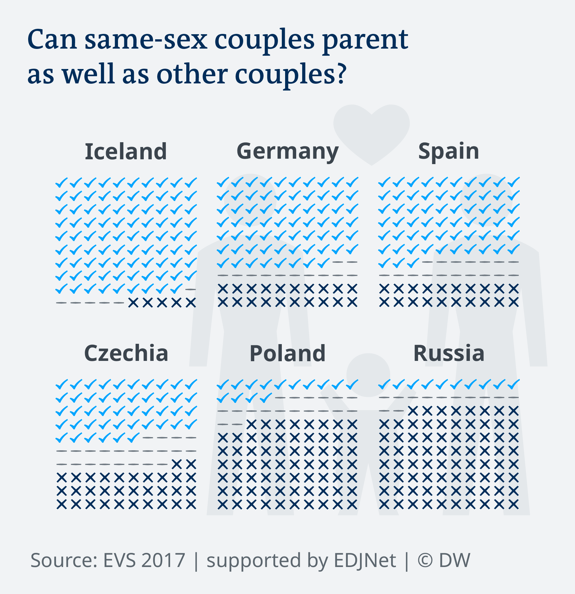  | Can same-sex couples parent as well as other couples?  | [Link](http://zacat.gesis.org/webview/index.jsp?headers=http%3A%2F%2F193.175.238.79%3A80%2Fobj%2FfVariable%2FZA7500_V108&V85subset=1+-+2%2C-1&stubs=http%3A%2F%2F193.175.238.79%3A80%2Fobj%2FfVariable%2FZA7500_V11&study=http%3A%2F%2F193.175.238.79%3A80%2Fobj%2FfStudy%2FZA7500&charttype=null&V11subset=40%2C100+-+203%2C276+-+756%2C81055&mode=table&v=2&V108slice=3&V86subset=1+-+2%2C-1&gs=2&tabcontenttype=row&group=agg%7CV11%7C1%7C40%2C100%2C112%2C191%2C203%2C276%2C352%2C528%2C616%2C643%2C703%2C705%2C724%2C756%7CEurope_custom%7Ctrue%7C81055&group=agg%7CV108%7C1%7C1%2C2%7Cyes%7Ctrue%7C142731&group=agg%7CV108%7C1%7C4%2C5%7Cno%7Ctrue%7C126715&V11slice=81055&V108subset=3%2C142731%2C126715&top=yes)  |

## Social media Video

In the file `values_video.xlsx` you'll also find a list of all the variables, values and the original EVS questions they relate to.

| Text  | Source  |
|---|---|
| If Europe were 100 people |  |
| 37 would say they trust the EU | [EU: 37%](http://zacat.gesis.org/webview/index.jsp?v=2&stubs=http%3A%2F%2F193.175.238.79%3A80%2Fobj%2FfVariable%2FZA7500_V157&layers=http%3A%2F%2F193.175.238.79%3A80%2Fobj%2FfVariable%2FZA7500_V11&study=http%3A%2F%2F193.175.238.79%3A80%2Fobj%2FfStudy%2FZA7500&charttype=null&gs=3&group=agg%7CV11%7C1%7C40%2C100%2C112%2C191%2C203%2C276%2C352%2C528%2C616%2C643%2C703%2C705%2C724%2C756%7CEurope_custom%7Ctrue%7C81055&V11slice=81055&V157slice=1&mode=table&top=yes) |
| Only 33 trust their own government | [government: 33% have confidence](http://zacat.gesis.org/webview/index.jsp?stubs=V164&V164slice=1&layers=http%3A%2F%2F193.175.238.79%3A80%2Fobj%2FfVariable%2FZA7500_V11&study=http%3A%2F%2F193.175.238.79%3A80%2Fobj%2FfStudy%2FZA7500&charttype=null&mode=table&V164subset=1+-+4%2C-1&v=2&gs=3&group=agg%7CV11%7C1%7C40%2C100%2C112%2C191%2C203%2C276%2C352%2C528%2C616%2C643%2C703%2C705%2C724%2C756%7CEurope_custom%7Ctrue%7C191691&V11slice=191691&top=yes) |
| but 51 trust their military | [military: 59%](http://zacat.gesis.org/webview/index.jsp?stubs=V149&V149slice=1&layers=http%3A%2F%2F193.175.238.79%3A80%2Fobj%2FfVariable%2FZA7500_V11&study=http%3A%2F%2F193.175.238.79%3A80%2Fobj%2FfStudy%2FZA7500&charttype=null&V149subset=1+-+4%2C-1&mode=table&v=2&gs=3&group=agg%7CV11%7C1%7C40%2C100%2C112%2C191%2C203%2C276%2C352%2C528%2C616%2C643%2C703%2C705%2C724%2C756%7CEurope_custom%7Ctrue%7C172645&V11slice=172645&top=yes) |
| Who do people trust the least? Political parties. | [political parties: 18%](http://zacat.gesis.org/webview/index.jsp?stubs=V163&V163slice=1&layers=http%3A%2F%2F193.175.238.79%3A80%2Fobj%2FfVariable%2FZA7500_V11&study=http%3A%2F%2F193.175.238.79%3A80%2Fobj%2FfStudy%2FZA7500&charttype=null&V163subset=1+-+4%2C-1&mode=table&v=2&gs=3&group=agg%7CV11%7C1%7C40%2C100%2C112%2C191%2C203%2C276%2C352%2C528%2C616%2C643%2C703%2C705%2C724%2C756%7CEurope_custom%7Ctrue%7C59651&V11slice=59651&top=yes) |
| Europeans are split on whether they would sign a petition. | [have done: 39 would never do: 30](http://zacat.gesis.org/webview/index.jsp?stubs=V128&V128subset=1+-+3%2C-1&layers=V11&study=http%3A%2F%2F193.175.238.79%3A80%2Fobj%2FfStudy%2FZA7500&charttype=null&V128slice=1&mode=table&V11subset=40+-+756%2C140150&v=2&gs=3&group=agg%7CV11%7C1%7C40%2C100%2C112%2C191%2C203%2C276%2C352%2C528%2C616%2C643%2C703%2C705%2C724%2C756%7CEurope_custom%7Ctrue%7C140150&V11slice=140150&top=yes) |
| Europeans can't decide on video surveillance. | [yes: 54, no: 44, don't know: 2](http://zacat.gesis.org/webview/index.jsp?stubs=V240&V240subset=1+-+4%2C-1&layers=http%3A%2F%2F193.175.238.79%3A80%2Fobj%2FfVariable%2FZA7500_V11&study=http%3A%2F%2F193.175.238.79%3A80%2Fobj%2FfStudy%2FZA7500&charttype=null&mode=table&v=2&gs=3&V240slice=1&group=agg%7CV11%7C1%7C40%2C100%2C112%2C191%2C203%2C276%2C352%2C528%2C616%2C643%2C703%2C705%2C724%2C756%7CEurope_custom%7Ctrue%7C45933&V11slice=45933&top=yes) |
| Some people don't like how their country is run. | [satisfaction by country](http://zacat.gesis.org/webview/index.jsp?headers=http%3A%2F%2F193.175.238.79%3A80%2Fobj%2FfVariable%2FZA7500_V177&v=2&stubs=http%3A%2F%2F193.175.238.79%3A80%2Fobj%2FfVariable%2FZA7500_V11&study=http%3A%2F%2F193.175.238.79%3A80%2Fobj%2FfStudy%2FZA7500&charttype=null&gs=3&V240slice=1&V177slice=1&V11slice=45933&mode=table&top=yes) |
| But: People still think democracy is very important | [importance of democracy 1-10 average: 8.7, more than half said 10](http://zacat.gesis.org/webview/index.jsp?stubs=V175&layers=http%3A%2F%2F193.175.238.79%3A80%2Fobj%2FfVariable%2FZA7500_V11&study=http%3A%2F%2F193.175.238.79%3A80%2Fobj%2FfStudy%2FZA7500&charttype=null&V175slice=1&mode=table&v=2&V175subset=1+-+10%2C-1&gs=3&group=agg%7CV11%7C1%7C40%2C100%2C112%2C191%2C203%2C276%2C352%2C528%2C616%2C643%2C703%2C705%2C724%2C756%7CEurope_custom%7Ctrue%7C147663&V11slice=147663&top=yes) |
| Data: European Values Study 2017 | [EVS 2017](https://europeanvaluesstudy.eu/methodology-data-documentation/survey-2017/) |
